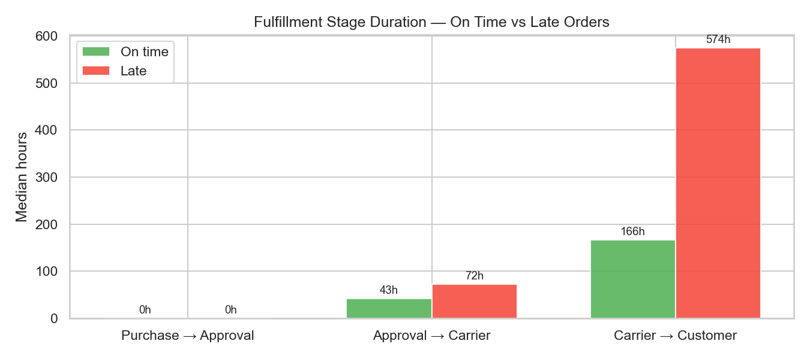
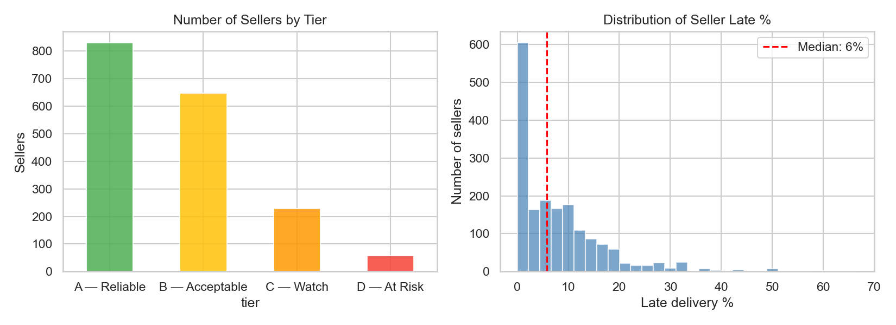
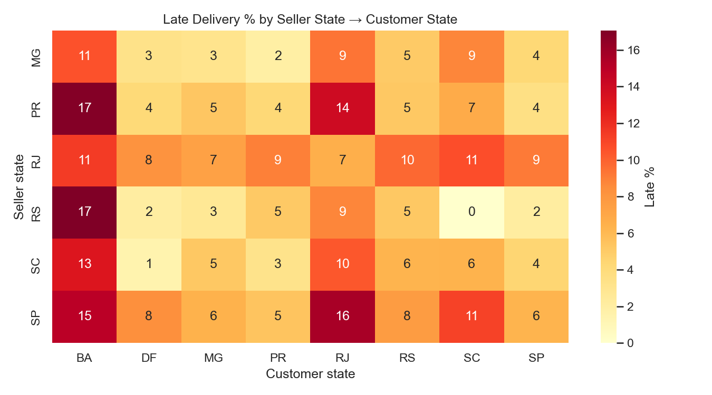
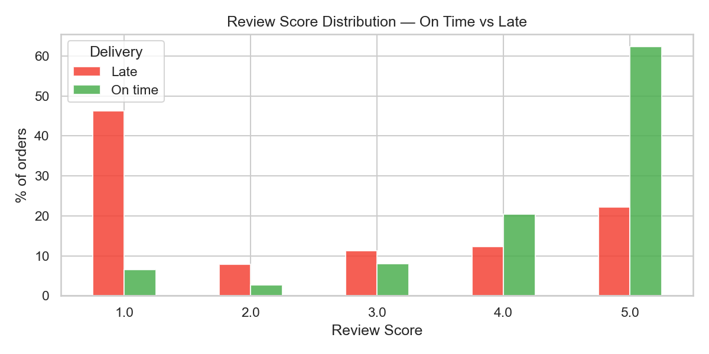
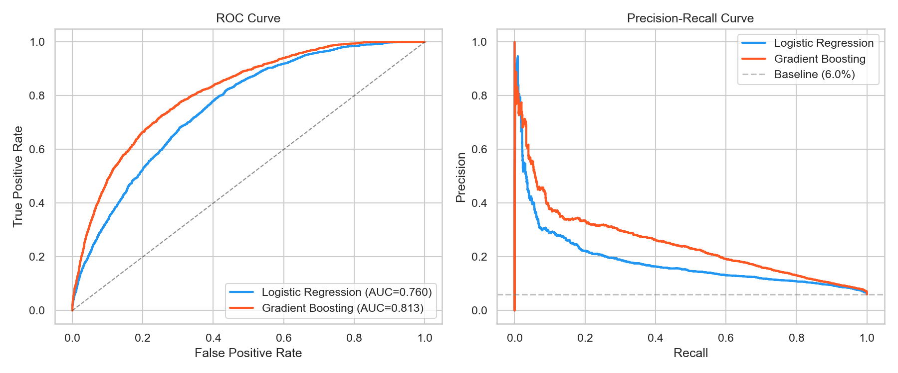
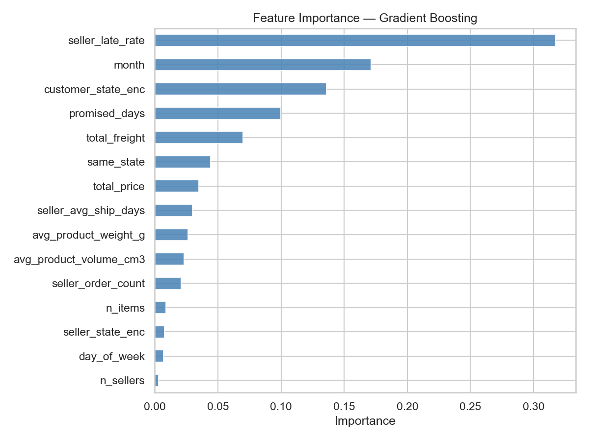
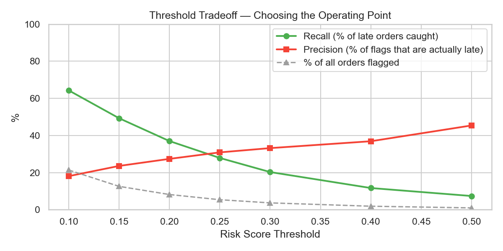

# Marketplace Fulfillment Risk Analysis

An end-to-end operations analytics project that decomposes a marketplace's delivery pipeline, identifies root causes of late deliveries, and builds a risk-scoring model to flag at-risk orders at placement time.

Built with **SQL** (SQLite) and **Python** (pandas, scikit-learn, matplotlib).

---

## Problem Statement

Late deliveries are the leading driver of 1-star reviews on the platform. 46% of late orders receive a 1-star review, compared to just 6% of on-time orders; a 7.7x multiplier. This project answers three questions:

1. **Where in the fulfillment pipeline do delays happen?**
2. **Which sellers and shipping corridors are most at risk?**
3. **Can we flag at-risk orders at placement time and intervene?**

## Dataset

[Brazilian E-Commerce Public Dataset (Olist)](https://www.kaggle.com/datasets/olistbr/brazilian-ecommerce) — ~100K orders across 8 relational tables, covering 2016–2018. Tables were loaded into a SQLite database with indexed joins for analytical querying.

## Key Findings

### 1. The transit leg is the bottleneck

The fulfillment pipeline has three stages: purchase→approval, approval→carrier pickup, and carrier→customer delivery. The first two stages show modest differences between on-time and late orders (0h vs 0h for approval; 43h vs 72h for seller prep). The carrier-to-customer leg explodes: **166 hours for on-time orders vs. 574 hours for late orders**, a gap of 408 hours (~17 days). Over 90% of the excess delay sits in logistics, not internal processing or seller slowness.



### 2. A small seller tail drives disproportionate lateness

Of ~1,750 sellers with 5+ orders, roughly 830 are Reliable (≤5% late rate) and 645 are Acceptable (5–15%). Only ~55 sellers (~3%) are At Risk (>30% late rate), but they contribute an outsized share of late orders. The median seller late rate is 6%. Targeted intervention on the worst-performing sellers would have an outsized impact relative to effort.



### 3. Geography is a structural risk factor

Deliveries to Bahia (BA) and Rio de Janeiro (RJ) consistently show 13–17% late rates regardless of seller origin. The worst corridors are SP→RJ (16%), PR→BA (17%), and RS→BA (17%). Same-state deliveries perform significantly better, confirming that distance is a key lateness driver.



### 4. Late deliveries devastate customer satisfaction

46% of late orders get a 1-star review vs. 6% for on-time. On-time orders receive 5-star reviews 62% of the time; late orders only 22%. Late delivery is the strongest single predictor of a negative review in the dataset.



## Risk-Scoring Model

A Gradient Boosting classifier flags orders at risk of late delivery using only features available at order placement (no data leakage). Trained on orders before April 2018, tested on April 2018 onward (time-based split).

**Performance:** AUC = 0.813



**Top predictive features:**

| Feature | Importance |
|---------|-----------|
| Seller historical late rate | 0.32 |
| Month of purchase | 0.17 |
| Customer state | 0.13 |
| Promised delivery window | 0.09 |
| Freight value | 0.07 |

The seller's past late delivery rate alone accounts for 32% of the model's predictive power — confirming that seller reliability is the most actionable lever.



**Threshold analysis:** The operating point depends on intervention capacity. At a 0.20 threshold, the model flags ~8% of orders and catches ~37% of actual late deliveries. Lowering to 0.15 flags ~13% and catches ~50%.



## Recommendations

**Intervention 1 — Adjust delivery estimates for flagged orders.** Add a 3–5 day buffer to the promised delivery window on high-risk orders. Zero cost. Converts "late" deliveries into "on-time" by managing customer expectations upfront.

**Intervention 2 — Proactive customer notification.** For flagged orders that haven't reached the carrier by day 7, send an automated status update. Minimal cost (automated messaging). Reduces surprise and the resulting 1-star reviews.

**Intervention 3 — Seller accountability program.** Surface D-tier sellers in internal dashboards. Require improvement plans for sellers with >30% late rate. Addresses the root cause.

## Project Structure

```
├── data/                # Raw CSVs + SQLite database (not committed)
├── notebooks/
│   ├── 01_exploration.ipynb          # Schema, data quality, baseline metrics
│   ├── 02_diagnostic_analysis.ipynb  # Stage decomposition, seller tiers, geography
│   └── 03_modeling.ipynb             # Risk model, threshold analysis, business case
├── sql/
│   └── queries.sql      # Analytical base table + diagnostic queries
├── src/
│   └── setup_db.py      # CSV → SQLite loader with indexes
├── output/              # All charts
├── README.md
└── requirements.txt
```

## How to Reproduce

1. Download the [Olist dataset](https://www.kaggle.com/datasets/olistbr/brazilian-ecommerce) and place CSVs in `data/`
2. Run `python src/setup_db.py` to build the SQLite database
3. Open notebooks in order: 01 → 02 → 03

**Requirements:** Python 3.10+, pandas, numpy, scikit-learn, matplotlib, seaborn, sqlalchemy.
